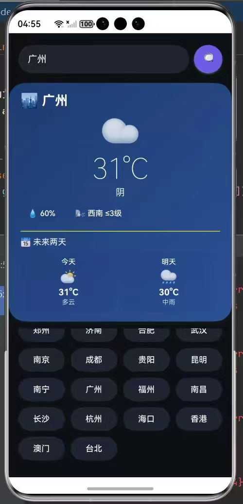
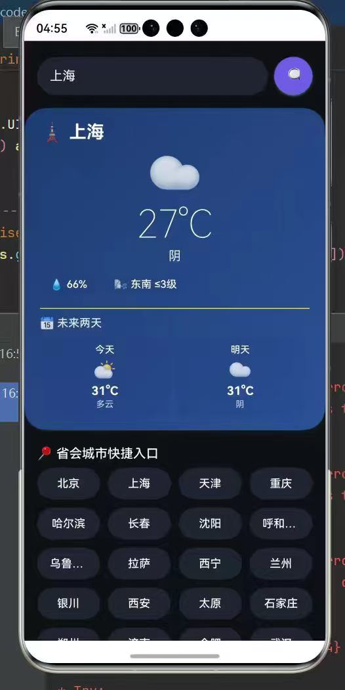
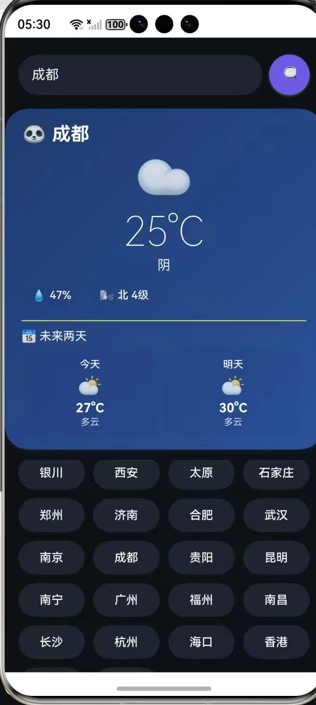
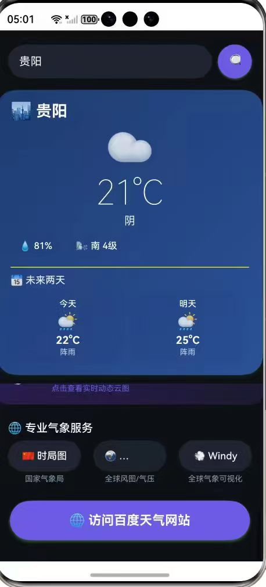
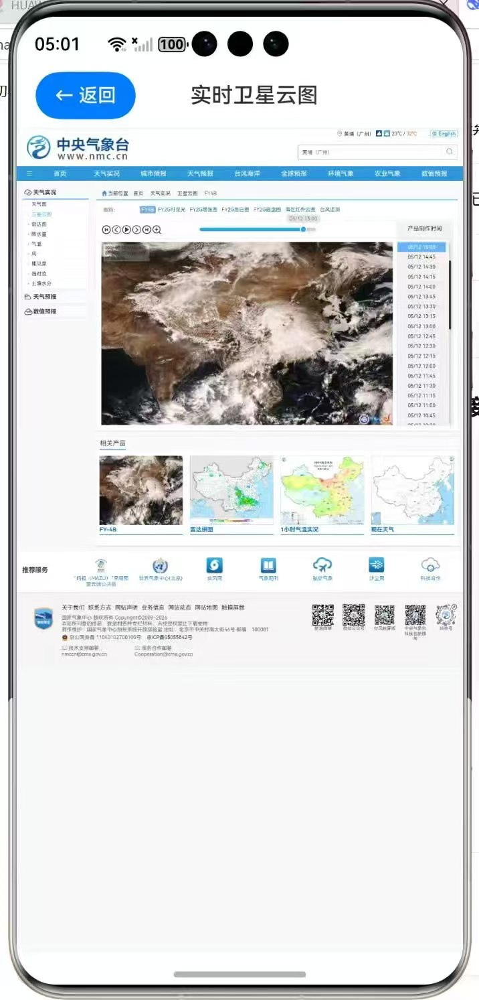
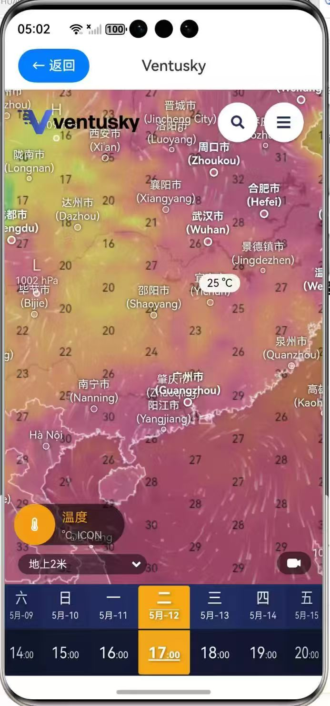
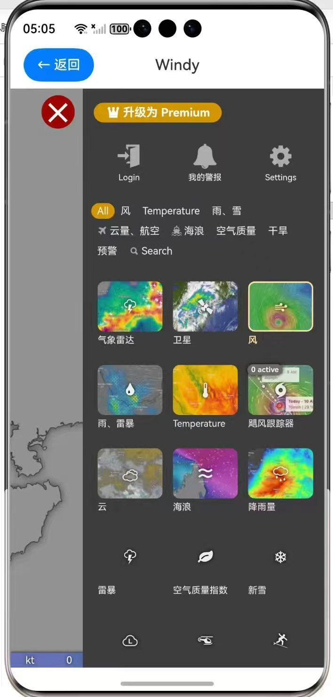
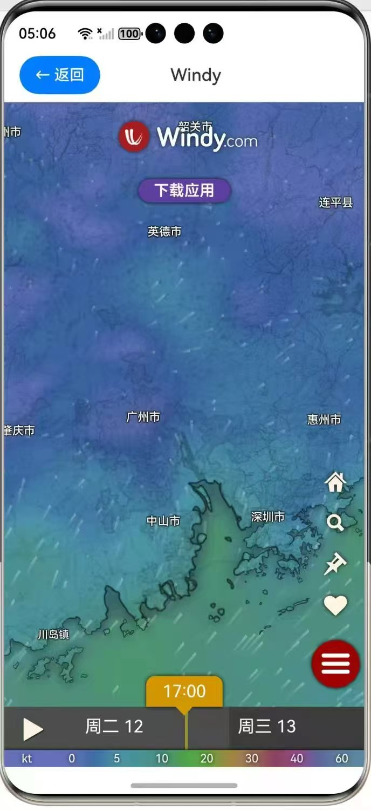

# 🌤️ 鸿蒙天气应用 WeatherAPP

基于 HarmonyOS NEXT 开发的智能天气查询应用，提供实时天气、逐日预报、城市搜索、专业气象服务入口等丰富功能。采用科幻深海风格 UI，支持 34 个主要城市快捷切换，并集成中国气象局、Windy 等专业平台。

---

## 📱 功能特性

### 1. 实时天气查询
- 输入任意城市名（支持中文），获取**当前温度、天气状况、湿度、风向风力**
- 数据来源：高德地图天气 API（实时更新）
- 智能匹配城市 POI，支持模糊搜索



### 2. 未来两天预报
- 展示**今天 + 明天**的天气概况
- 自动区分白天/夜间：根据当前时间智能显示日间或夜间温度
- 包含天气图标、温度、天气文字描述



### 3. 城市快捷入口
- 提供 **34 个直辖市、省会及特别行政区** 按钮
- 采用网格布局，一触即达
- 每个城市配有特色 emoji（如北京🏯、成都🐼）



### 4. 智能城市搜索
- 点击搜索按钮弹出对话框
- 支持**模糊搜索**：输入“广州”可匹配“广州市”、“广东省广州市”等
- 搜索结果来自高德 POI 接口，自动过滤出城市/区县级别结果
- 点击结果直接切换城市并刷新天气


### 5. 专业气象服务集成
内置多个权威气象平台入口，一键跳转：

| 服务 | 说明 | 来源 |
| :--- | :--- | :--- |
| 🛰️ 卫星云图 | 风云二号红外云图，实时动态 | 中央气象台 |
| 🇨🇳 时局图 | 中国天气网气象云图产品 | 国家气象局 |
| 🌍 Ventusky | 全球风场、气温、气压可视化 | 捷克公司 |
| 💨 Windy | 高分辨率气象动画，支持多图层 | 国际平台 |
| 🌐 百度天气 | 综合搜索当前城市详细预报 | 百度搜索 |
- 点击以下按钮可切换到专业气象服务界面

- 以下是卫星云图界面

- 以下是中央气象台界面

- 以下是"Ventusky"专业气象软件界面


- 以下是"Windy"全球风场图




### 6. 科幻深海 UI 设计
- 深蓝渐变背景 + 毛玻璃卡片效果
- 动态天气 emoji 实时映射（晴☀️、雨🌧️、雪❄️等）
- 城市特色 emoji，增强辨识度
- 阴影与圆角营造舒适视觉

### 7. 全平台适配
- 支持手机、折叠屏、平板（响应式布局）
- 滚动视图确保所有内容可触达

---

## 📁 项目目录结构


---

## 设计思路

### 为什么选择科幻深海风格？
- **沉浸感**：深蓝渐变模拟从深海到星空的过渡
- **信息清晰**：白色文字与毛玻璃卡片对比舒适
- **情感关联**：天气 emoji 直观传递天气情绪


### 交互细节
- **搜索弹窗**：点击外部关闭，符合移动端习惯
- **快捷按钮**：34个城市网格布局，一目了然
- **预测展示**：未来两天卡片并列，方便对比
- - **便捷性**： 省会城市快捷按钮方便随时点击查询

---

## 技术栈

| 类别 | 技术 |
| :--- | :--- |
| 开发环境 | DevEco Studio NEXT Beta1+ |
| 开发语言 | ArkTS |
| UI 框架 | HarmonyOS SDK (API 9+) |
| 网络请求 | `@ohos.net.http` |
| 天气 API | 高德地图天气 API v3 |

---

## 快速开始

### 环境要求
- DevEco Studio 5.0.3+
- HarmonyOS SDK API 9+

### 安装与运行

1. **克隆仓库**
   ```bash
   git clone https://github.com/OSSD-Course-SYSU-2/WeatherAPP25307076.git